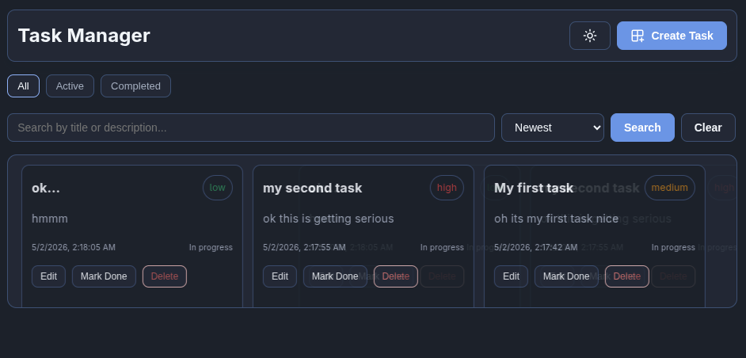

# Setup

In order to run the webapp you need Node.js 22+ LTS installed on your system.

Clone the repository and then continue with the commands below:

```bash
git clone git@github.com:CCXLV/giorgi_merebashvili_helfy_task.git
```

## Install dependencies

Run this command at the root directory:

```bash
cd backend && npm i && cd ../frontend && npm i
```

## Run the servers

Run this command in one terminal to startup the backend:

```bash
cd backend && npm start
```

and run this on another terminal for the frontend:

```bash
cd frontend && npm run dev
```

Now the backend is running at `http://localhost:4000` and the frontend at `http://localhost:3000`.

# API Documentation

The API is serving `/tasks` endpoint at `/api` prefix:

```
GET - /api/tasks - Get all tasks
POST - /api/tasks - Create a task
PUT - /api/tasks/:id - Update a task
DELETE - /api/tasks/:id - Delete a task
PATCH - /api/tasks/:id/toggle - Toggle `complete` status of the task
```

# Any assumptions or design decisions made

- Per assignment, tasks live in memory only (no DB), so they clear when the backend process restarts.
- Frontend talks to `http://localhost:4000/api` (same machine as the dev servers).
- Carousel is a CSS-driven loop (no carousel library); hover pauses the animation.
- Create/edit use the same form in a `<dialog>` modal; delete is immediate (no extra confirm step).

# Time spent on each part

- Backend - ~40 minutes
- Frontend with styling - ~2.4hours
- Polishing the code - ~20 minutes
- Testing - ~25 minutes

# Screenshot

<p align="center">
  
</p>
